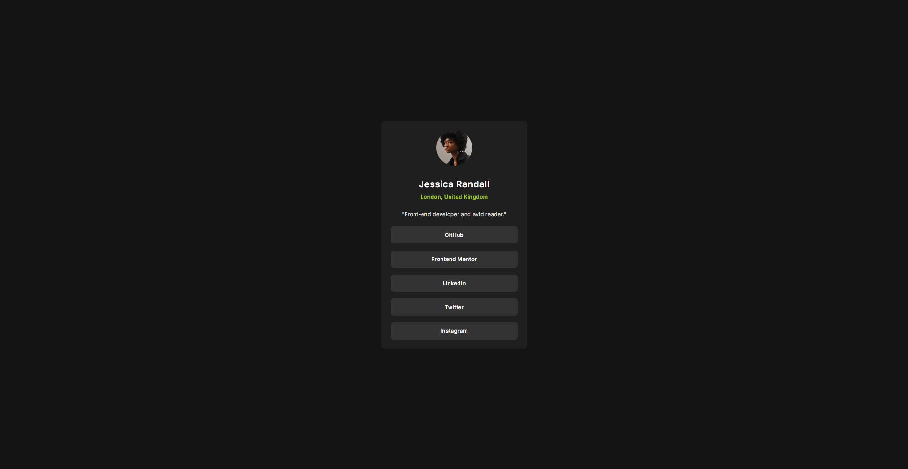

# Frontend Mentor - Social links profile solution

This is a solution to the [Social links profile challenge on Frontend Mentor](https://www.frontendmentor.io/challenges/social-links-profile-UG32l9m6dQ). Frontend Mentor challenges help you improve your coding skills by building realistic projects. 

## Table of contents
- [Overview](#overview)
  - [The challenge](#the-challenge)
  - [Screenshot](#screenshot)
  - [Links](#links)
- [My process](#my-process)
  - [Built with](#built-with)
  - [What I learned](#what-i-learned)
  - [Continued development](#continued-development)
  - [AI Collaboration](#ai-collaboration)
- [Author](#author)

## Overview

### The challenge

Users should be able to:

- See hover and focus states for all interactive elements on the page

### Screenshot



### Links

- Solution URL: [https://github.com/Segarur21/social-links-profile-main](https://github.com/Segarur21/social-links-profile-main)
- Live Site URL: [https://segarur21.github.io/social-links-profile-main/](https://segarur21.github.io/social-links-profile-main/)

## My process

### Built with

- Semantic HTML5 markup (`<main>`, `<article>`, `<ul>`)
- CSS custom properties (Variables)
- Flexbox for layout and spacing
- 62.5% font-size base (`1rem = 10px`)

### What I learned

During this project, I reinforced clean CSS architecture, semantic structuring, and layout centering. 

Highlights from my CSS refactoring:

 **Flexbox Gap over Margins:** Replacing margin-based item spacing with Flexbox `gap` eliminated layout hacks like `:last-child`.

Example CSS implementation:

```css
.profile-links {
  list-style: none;
  display: flex;
  flex-direction: column;
  gap: 1.8rem;
}
```


### Continued development

In upcoming projects, I want to keep refining:
- Advanced accessibility practices (ARIA labels and screen reader testing).
- More complex Flexbox and CSS Grid combinations for multi-section layouts.

### AI Collaboration

I collaborated with an AI assistant during this challenge as an interactive peer to:
- **Debug & Refactor:** Identify why the card component was not stretching by resolving parent-container constraints on the `<main>` tag.
- **Optimize CSS:** Clean up inherited redundant properties (such as `text-align`) and modernize list layout logic using Flexbox `gap`.
- **Verify Design Precision:** Fine-tune typographic hierarchies (`font-weight`) and spatial balance against the challenge design assets.

## Author

- Frontend Mentor - [@Segarur21](https://www.frontendmentor.io/profile/Segarur21)
- GitHub - [@Segarur21](https://github.com/Segarur21)